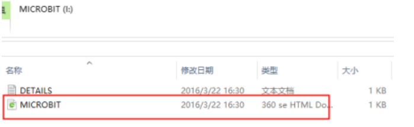
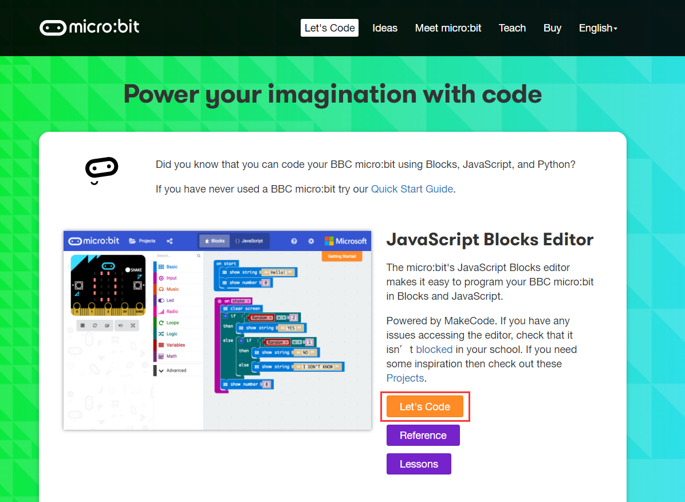
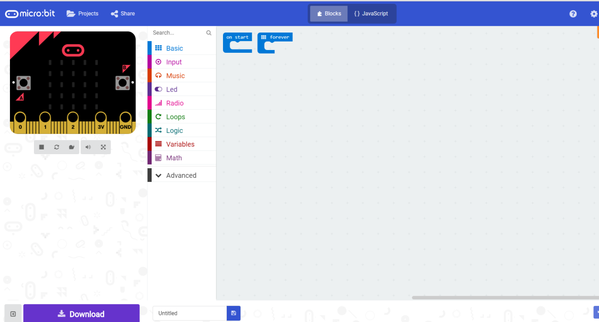
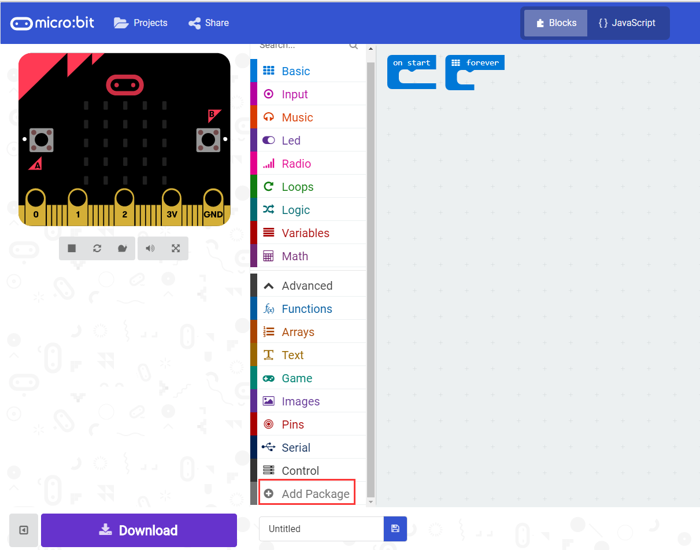
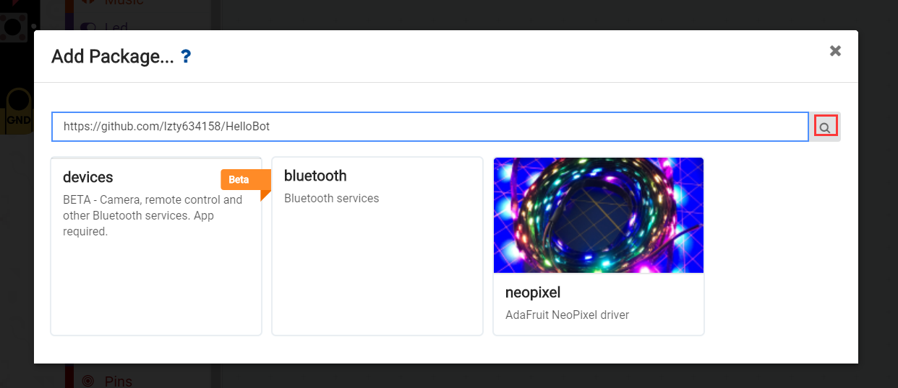
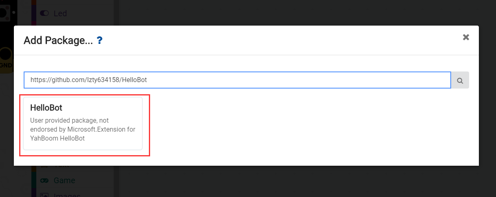
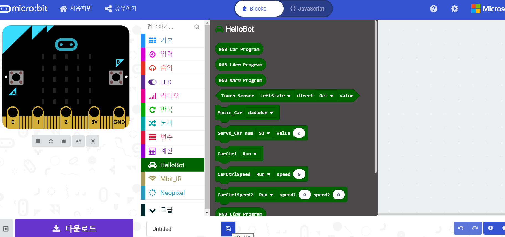
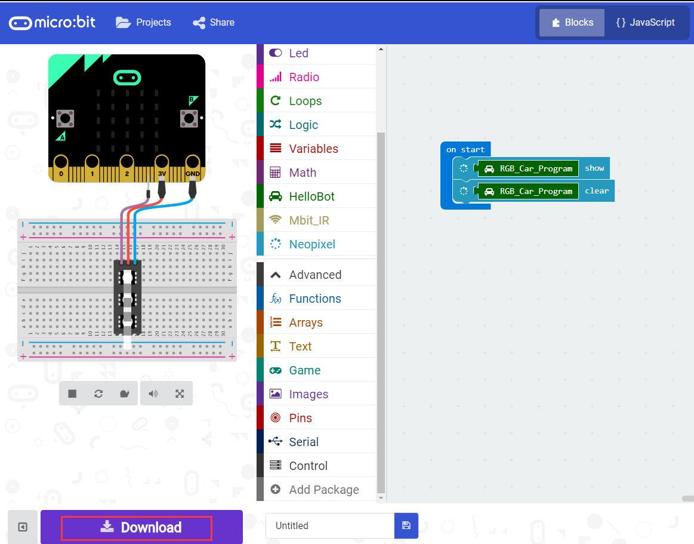
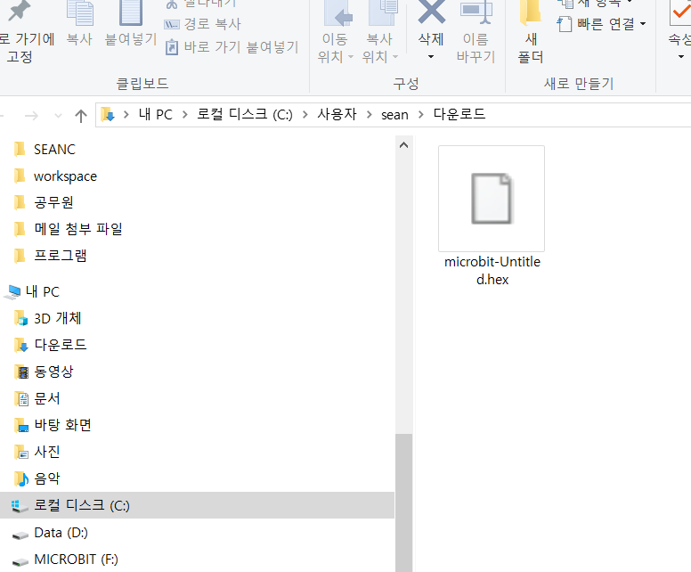

Chapter0 :프로그램 방법들에 대한 소개
====================================================

온라인 프로그램
------------------------

1.컴퓨터에 USB 케이블로 마이크로비트를 연결해야 한다.
컴퓨터에 연결되면 컴퓨터에 MICROBIT 라는 디스크가 열릴것이다.
그리고 브라우저에서  http://microbit.org/ 열면 된다.

|image0|
2. 공식 사이트에 들어간후 아래 인터페이스를 볼수 있을것이다.

|image1|

3. "코드만들기"를 클릭하자.

|image2|

|image3|

4. 다음과 같이 프로그램 모드로 들어간다.

|image4|

5. 확장 패키지를 포함시켜야 한다.

|image5|

6. 다음 사이트를 넣으면 패키지가 포함된다.
https://github.com/lzty634158/HelloBot

|image6|

|image7|

|image8|

7. 패키지를 인스톨 하게되면 다음과 같이 Hellobot 패키지가 보인다.

|image9|

8.다음 처럼 download를 클릭하면 ***.hex 파일이 다운된다.

|image10|

 

|image11| 

|image12| 

*.hex 파일을 microbit 디스크에 넣어 주기만 하면 된다.

.. |image1| image:: ./chapter0/media/image2.png
   :width: 5.75972in
   :height: 2.87222in
.. |image2| image:: ./chapter0/media/image3.png
   :width: 5.76597in
   :height: 3.68958in

.. |image6| image:: ./chapter0/media/image7.png
   :width: 5.76389in
   :height: 3.04722in

.. |image11| image:: ./chapter0/media/image12.png
   :width: 4.42708in
   :height: 2.06250in

