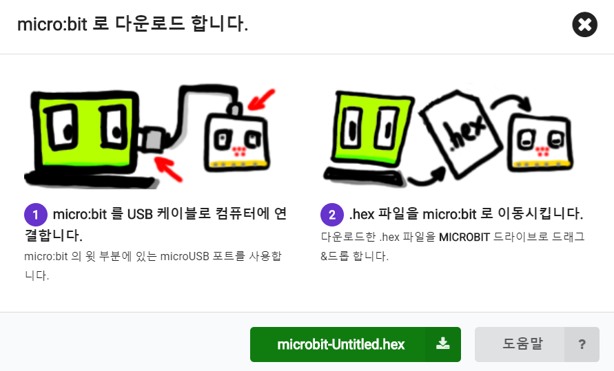

**Chapter0 :Introduction of programming methods**

**Programming online**

1. You should use the USB cable to connect the micro:bit to the
   computer, at this point, the computer will have a micro:bit U disk.
   You need to open it, click micro:bit website, then entered the
   micro:bit website or you can enter the URL directly in your browser:
   http://microbit.org/.

|image0|

2.After entering the official website, you can see the interface shown
below.

|image1|

3.You need to click “lets code”.

|image2|

|image3|

4. Then you can enter the programming interface as shown below.

|image4|

5.You need to click the icon as shown below to add a package.

|image5|

6.You need to input https://github.com/lzty634158/HelloBot to obtain
package.

|image6|

|image7|

|image8|

7.After the addition is complete, you can see Yaboom HelloBot package on
the left bar.

|image9|

8.After the building blocks, click Download. You can set the download
path in the U disk of micro:bit, download it to the computer, and then
copy it to the U disk in micro:bit. As shown in the following figure.

|image10|

 

|image11| 

|image12| 

|image13| 

After downloading, you can see the experimental phenomena in the code.

.. |image0| image:: media/image1.png
   :width: 4.63403in
   :height: 1.41875in

.. |image3| image:: media/image4.png
   :width: 5.76736in
   :height: 4.22431in
.. |image4| image:: media/image5.png
   :width: 5.76458in
   :height: 3.10347in
.. |image5| image:: media/image6.png
   :width: 5.76389in
   :height: 4.52639in

.. |image7| image:: media/image8.png
   :width: 5.75625in
   :height: 2.49792in
.. |image8| image:: media/image9.png
   :width: 5.76250in
   :height: 2.29861in
.. |image9| image:: media/image10.png
   :width: 5.75972in
   :height: 3.67153in
.. |image10| image:: media/image11.png
   :width: 5.76597in
   :height: 4.51667in

.. |image12| image:: media/image13.png
   :width: 3.61458in
   :height: 4.17708in
.. |image13| image:: media/image14.png
   :width: 4.73958in
   :height: 2.17708in
