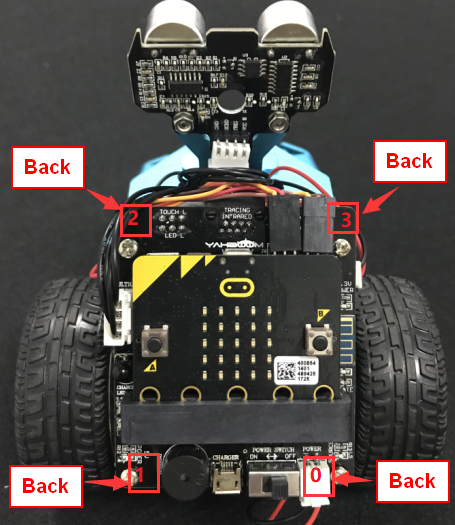
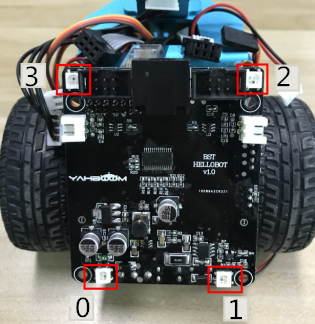
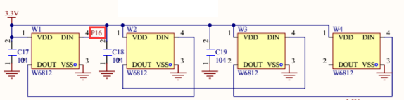
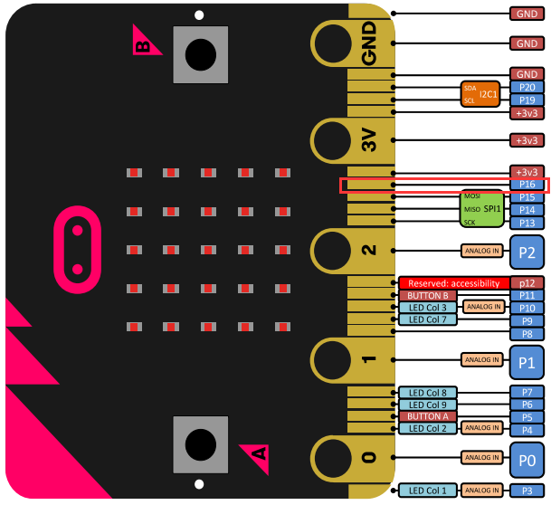
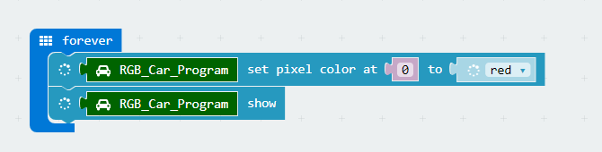
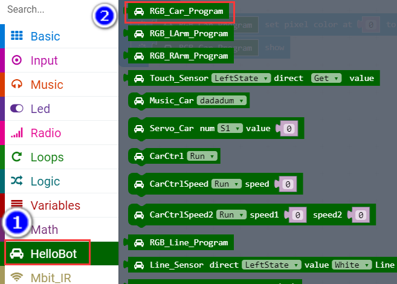
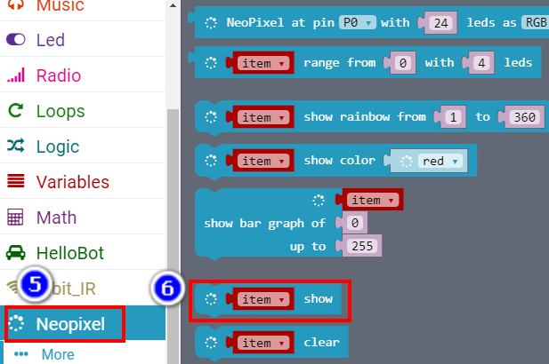
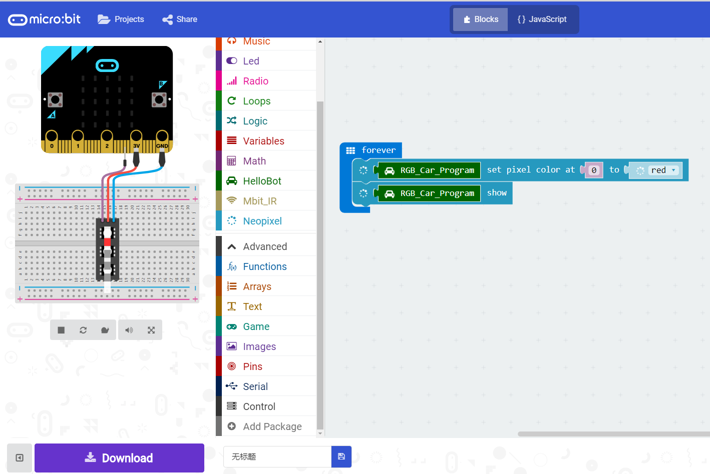
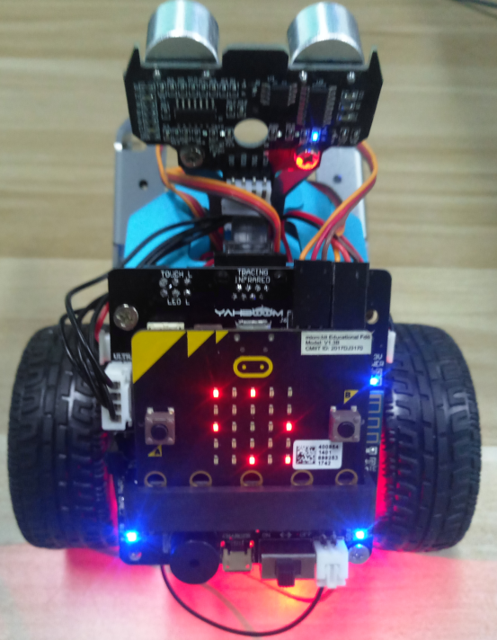

1. **Light up a colorful water lights on body of robot**

\ **1.Preparation**

1.You should learn about the position of the colorful lights in the body
of hellobot；

2.You should learn about the micro:bit pins connected to the colorful
lights in the schematic.

|image0|

1-1-1 colorful lights on body of hellobot（back）

|image1|

1-1-2 colorful lights on body of hellobot

We can make different colors of light and brightness by programming.

|image2|

1-1-3 schematic

|image3|

1-1-4 Pins of Micro:bit

From the schematic diagram in P1-1-3, you can see that the colorful
lights is connected to the P16 of the Micro:bit.

Note:In the bottom layer of the HelloBot package has been set parameter
for the user, you can directly drag the colorful lights building blocks.

2. **Learning goals**

The colorful lights is a combination of three colors of red (R), green
(G), and blue (B). The controller can control the output and the
brightness of each color to achieve a combination of different colors.

HelloBot body possess four colorful lights, this course we will study
how to light a colorful light on the body by programming.

**3.Programming**

3.1 Programming online

1) You should use the USB cable to connect the micro:bit to the
computer, at this point, the computer will have a micro:bit U disk. You
need to open it, click micro:bit website, then entered the micro:bit
website or you can enter the URL directly in your browser:
http://microbit.org/

2) After entering the programming interface, you need to click Add
package and copy the HelloBot package URL:
https://github.com/lzty634158/HelloBot to the input field, click to
confirm the add package. Then you can use the blocks of the HelloBot
package.

3.2 Programming offline

1) You can double-click to use it. As shown in the following figure.

|image4|

2) After entering the programming interface, you need to click Add
package and copy the HelloBot package URL:
https://github.com/lzty634158/HelloBot to the input field, click to
confirm the add package. Then you can use the blocks of the HelloBot
package.

**Note: The package only needs to be added once. If you have added
packages in the previous lessons, this course does not need to be added
repeatedly.**

|image5|

1-1-5 total program

The locations of blocks in the total program are shown in the following
figure.

|image6|

1-1-6

|image7|

1-1-7

|image8|

1-1-8

**4.Download programming**

You need to make sure that the micro:bit development board is connected
to the computer. Then you should click on the download in the lower left
corner as shown in P 1-1-9 to download the program to micro:bit.

|image9|

1-1-9

**5.Phenomenon**

After the code is uploaded. You can see that the colorful lamps in the
lower right corner of the HelloBot emit red light. In addition, you can
also modify the program to choose to light up different lights and emit
different colors of lights. As shown in the following figure.

|image10|

1-1-10

.. |image4| image:: ./chapter1/media/image5.png
   :width: 0.93472in
   :height: 0.79514in

.. |image7| image:: ./chapter1/media/image8.png
   :width: 5.76250in
   :height: 4.68194in

