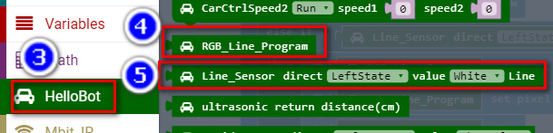

Chapter11 :추적에 따른 불빛 보이기
====================================================================

1.Preparation
---------------------

1.You should learn about the position of the RGB tracking obstacle
avoidance 3 in 1 module in the body of hellobot；

2.You should learn about the principle of the tracking.

|image0|

 7-1-1 RGB tracking obstacle avoidance 3 in 1 module

|image1|

7-1-2 RJ45 interface of RGB tracking obstacle avoidance 3 in 1 module

|image2| |image3|

(a) Back of module (c) Front of module

7-1-3 RGB tracking obstacle avoidance 3 in 1 module

|image4|

7-1-4 RJ45 interface and cable

The RGB tracking obstacle avoidance 3 in 1 module is installed under the
robot arm of the HelloBot, and we need to use the network cable to
connect the RGB tracking obstacle avoidance 3 in 1 module.

|image5|

7-1-5 schematic

|image6|

7-1-6 Pins of Micro:bit

From the schematic diagram. You can see that left probe is connected to
P1 of Micro:bit, right probe is connected to P1 of Micro:bit, colorful
lights is connected to P5 of Micro:bit.

Principle of tracking: The basic principle of the infrared tracking
sensor is to take advantage of the reflective nature of the object. When
the infrared light is emitted onto the black line, it will be absorbed
by the black line, but when the infrared light is emitted onto the other
colors line, it will be reflected onto the infrared receiver pin. When
the car's tracking module detect the black line, the indicator light is
light up, and when the white object was detected, the indicator light is
light out.

According to this, we write the corresponding code to make the car
complete tracking function.

**Note:**\ The tracking sensor is not working properly due to the
interference of outdoor light. This course needs to be carried out
indoors and the curtains are covered to block the outdoor light.

2. **Learning goals**

In this course, we will learn how to make tracking module detect the
black line, the colorful lights are green, and when the white object was
detected, the colorful lights are red.

**3.Programming**

3.1 Programming online

1) You should use the USB cable to connect the micro:bit to the
computer, at this point, the computer will have a micro:bit U disk. You
need to open it, click micro:bit website, then entered the micro:bit
website or you can enter the URL directly in your browser:
http://microbit.org/

2) After entering the programming interface, you need to click Add
package and copy the HelloBot package URL:
https://github.com/lzty634158/HelloBot to the input field, click to
confirm the add package. Then you can use the blocks of the HelloBot
package.

3.2 Programming offline

1) You can double-click to use it. As shown in the following figure.

|image7|

2) After entering the programming interface, you need to click Add
package and copy the HelloBot package URL:
https://github.com/lzty634158/HelloBot to the input field, click to
confirm the add package. Then you can use the blocks of the HelloBot
package.

Note: The package only needs to be added once. If you have added
packages in the previous lessons, this course does not need to be added
repeatedly.

|image8|

7-1-7 total program

The locations of blocks in the total program are shown in the following
figure.

|image9|

7-1-8

|image10|

7-1-9

|image11|

7-1-10

|image12|

7-1-11

**4.Download programming**

You need to make sure that the micro:bit development board is connected
to the computer. Then you should click on the download in the lower left
corner as shown in P 7-1-11 to download the program to micro:bit.

|image13|

7-1-12

**5.Phenomenon**

After the code is uploaded.

When the tracking probe of HellBot on the white material, you can see
that the indicator light on the module is off, and the colorful lights
is red.

When the tracking probe of HelloBot on the black material, you see that
the indicator light on the module is on, and the colorful lights is
green.

When the left tracking probe of HelloBot on the black material, you see
that the left indicator light on the module is on, and the colorful
lights is green.

When the right tracking probe of HelloBot on the black material, you see
that the right indicator light on the module is on, and the colorful
lights is green.

|image14|

7-1-13 The tracking probe on the white material

|image15|

7-1-14 The tracking probe on the black material

|image16|

7-1-15 The left tracking probe on the black material

|image17|

7-1-16 The right tracking probe on the black material

.. |image0| image:: ./chapter11/media/image1.png
   :width: 4.72431in
   :height: 3.95972in

.. |image7| image:: ./chapter11/media/image8.png
   :width: 0.93472in
   :height: 0.79514in
.. |image8| image:: ./chapter11/media/image9.png
   :width: 5.76806in
   :height: 3.37361in

