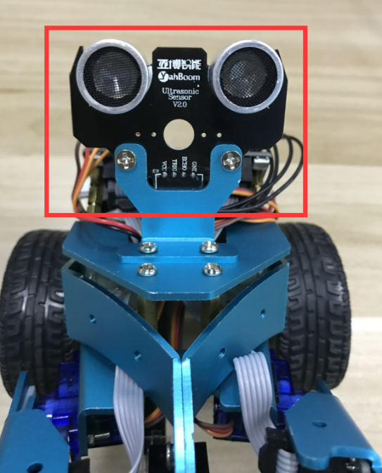
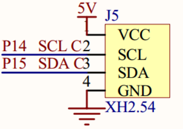
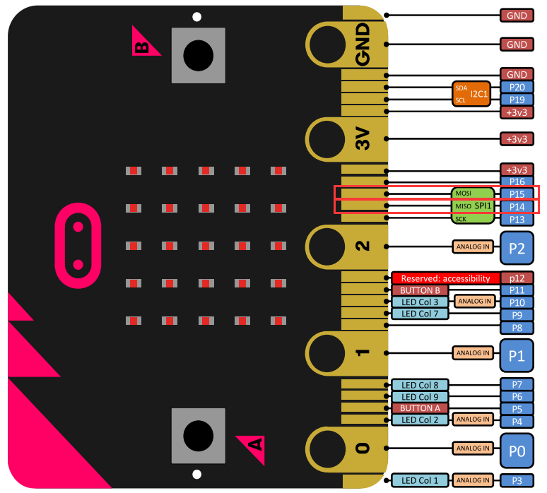
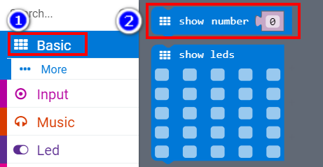
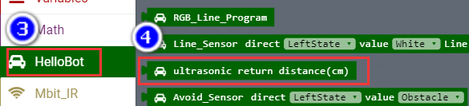
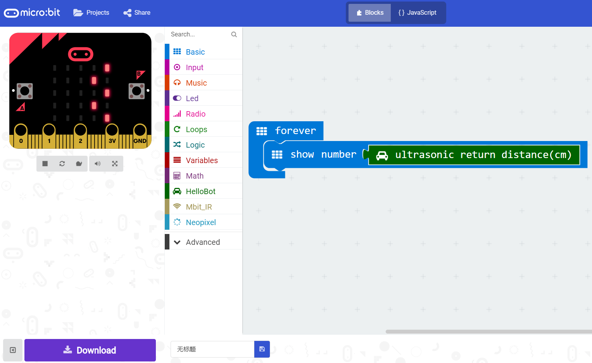
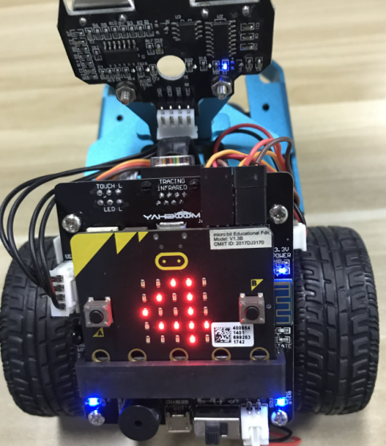
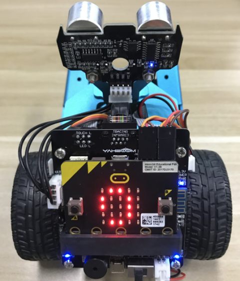

Chapter13 :초음파 거리재기
====================================================================

1.Preparation
----------------------

1.You should learn about the position of the Ultrasonic module in the
body of hellobot；

2.You should learn about the principle of the Ultrasonic module.

|image0| |image1|

8-1-1 position of Ultrasonic module 8-1-2 position of wiring

Both the ultrasonic interface and the expansion board interface are
designed with anti-reverse connection. The ultrasonic module is
connected to the left side of the expansion board by the 4Pin cable.

|image2|

8-1-3 schematic of ultrasonic module

|image3|

8-1-4 Pins of Micro:bit

From the schematic diagram. You can see that Pin \_Trig of ultrasonic
module(SCL) is connected to P14 of Micro:bit, Pin\_Echo of ultrasonic
module(SDA) connected to P15 of Micro:bit.

Principle of ultrasonic module:

1)The ultrasonic module is a sensor that uses ultrasonic characteristics
to detect the distance. It has two ultrasonic probes for transmitting
and receiving ultrasonic waves. The range of measurement is 3-450 cm.

2)You need to input a high level signal of at least 10us to the Trig pin
to trigger the ranging function of the ultrasonic module.

3)After the ranging function is triggered, the module will automatically
send out 8 ultrasonic pulses with 40 kHz and automatically detect
whether there is a signal return. This step is done internally by the
module.

4)When the module detects an echo signal, the ECHO pin will output a
high level. The high level duration is the time from when the ultrasonic
wave is sent to when it returns. You can calculate the distance by using
the time function to calculate the high level duration.

**Formula: Distance = High level duration \* Speed of sound(340M/S)/2.
**

**2.Learning goals**

In this course, we will learn how to measure distance by ultrasonic
module,and display distance on Micro:bit dot matrix.

**3.Programming**

3.1 Programming online

1) You should use the USB cable to connect the micro:bit to the
computer, at this point, the computer will have a micro:bit U disk. You
need to open it, click micro:bit website, then entered the micro:bit
website or you can enter the URL directly in your browser:
http://microbit.org/

2) After entering the programming interface, you need to click Add
package and copy the HelloBot package URL:
https://github.com/lzty634158/HelloBot to the input field, click to
confirm the add package. Then you can use the blocks of the HelloBot
package.

3.2 Programming offline

1) You can double-click to use it. As shown in the following figure.

|image4|

2) After entering the programming interface, you need to click Add
package and copy the HelloBot package URL:
https://github.com/lzty634158/HelloBot to the input field, click to
confirm the add package. Then you can use the blocks of the HelloBot
package.

Note: The package only needs to be added once. If you have added
packages in the previous lessons, this course does not need to be added
repeatedly.

|image5|

8-1-5 total program

The locations of blocks in the total program are shown in the following
figure.

|image6|

8-1-6

|image7|

8-1-7

**4.Download programming**

You need to make sure that the micro:bit development board is connected
to the computer. Then you should click on the download in the lower left
corner as shown in P 8-1-8 to download the program to micro:bit.

|image8|

8-1-8

**5.Phenomenon**

After the code is uploaded. You can see the distance measured by the
ultrasonic module on the dot matrix. As shown in the following figure.

(Note:Since the expansion board uses multiple pins, there will be some
influence between the pins, which will cause the number displayed on the
dot matrix to be somewhat defective. This is normal phenomenon.)

|image9| |image10|

(a) (b)

8-1-9

.. |image1| image:: ./chapter13/media/image2.png
   :width: 2.67292in
   :height: 3.04722in

.. |image4| image:: ./chapter13/media/image5.png
   :width: 0.93472in
   :height: 0.79514in

