Chapter16 :회피와 따라가기
====================================================================

1.Preparation
---------------------

1.You should learn about the position of the infrared module in the body
of hellobot；

2.You should learn about the principle of the infrared obstacle
avoidance.

|image0|

9-2-1 position of infrared module

|image1|

9-2-2 RJ45 interface of RGB tracking obstacle avoidance 3 in 1 module

|image2|

(b) infrared obstacle avoidance probe

9-2-2 RGB tracking obstacle avoidance 3 in 1 module

When there is an obstacle in front, indicator light is on, when there is
not an obstacle in front, indicator light is off.

|image3|

9-2-3 about wiring

The RGB tracking obstacle avoidance 3 in 1 module is installed under the
robot arm of the HelloBot, and we need to use the network cable to
connect the RGB tracking obstacle avoidance 3 in 1 module.

|image4|

9-2-4 schematic

|image5|

9-2-5 schematic of motor drive

|image6|

9-2-6 schematic of PCA9685PW

|image7|

9-2-7 Pins of Micro:bit

From the schematic diagram. You can see that Pin \_Trig of ultrasonic
module(SCL) is connected to P3 of Micro:bit, Pin\_Echo of ultrasonic
module(SDA) connected to P4 of Micro:bit.

PCA9685PW connects micro:bit P19 and P20 pins for I2C communication.

Principle of infrared obstacle avoidance:

The basic principle of the infrared sensor to avoid obstacles is to use
the reflective nature of the object. Within a certain range, if there is
an obstacle, the infrared rays will encounter obstacle and will be
reflected to reach the sensor receiving pin.

**Note:**\ The infrared obstacle avoidance sensor is not working
properly due to the interference of outdoor light. This course needs to
be carried out indoors and the curtains are covered to block the outdoor
light.

**2.Learning goals**

You need to put the HelloBot robot in a spacious field, use the paper or
hand to block the infrared sensor in front, the indicator light is off,
and the robot follows the object in front. When only the object is
detected on the left side, the left indicator light is off, and the
robot turn left in place to follow the obstacle. When only the object is
detected on the right side, the light on the right side is off, and the
turn right in place to follow the obstacle. When there is no object in
front, the indicator light is on and the car stop.

**3.Programming**

3.1 Programming online

1) You should use the USB cable to connect the micro:bit to the
computer, at this point, the computer will have a micro:bit U disk. You
need to open it, click micro:bit website, then entered the micro:bit
website or you can enter the URL directly in your browser:
http://microbit.org/

2) After entering the programming interface, you need to click Add
package and copy the HelloBot package URL:
https://github.com/lzty634158/HelloBot to the input field, click to
confirm the add package. Then you can use the blocks of the HelloBot
package.

3.2 Programming offline

1) You can double-click to use it. As shown in the following figure.

|image8|

2) After entering the programming interface, you need to click Add
package and copy the HelloBot package URL:
https://github.com/lzty634158/HelloBot to the input field, click to
confirm the add package. Then you can use the blocks of the HelloBot
package.

Note: The package only needs to be added once. If you have added
packages in the previous lessons, this course does not need to be added
repeatedly.

|image9|

9-2-8 total program

The locations of blocks in the total program are shown in the following
figure.

|image10|

9-2-9

|image11|

9-2-10

|image12|

9-2-11

|image13|

9-2-12

**4.Download programming**

You need to make sure that the micro:bit development board is connected
to the computer. Then you should click on the download in the lower left
corner as shown in P 9-2-13 to download the program to micro:bit.

|image14|

9-2-13

**5.Phenomenon**

You need to put the HelloBot robot in a spacious field, use the paper or
hand to block the infrared sensor in front, the indicator light is off,
and the robot follows the object in front. When only the object is
detected on the left side, the left indicator light is off, and the
robot turn left in place to follow the obstacle. When only the object is
detected on the right side, the light on the right side is off, and the
turn right in place to follow the obstacle. When there is no object in
front, the indicator light is on and the car stop.

|image15|

9-2-14

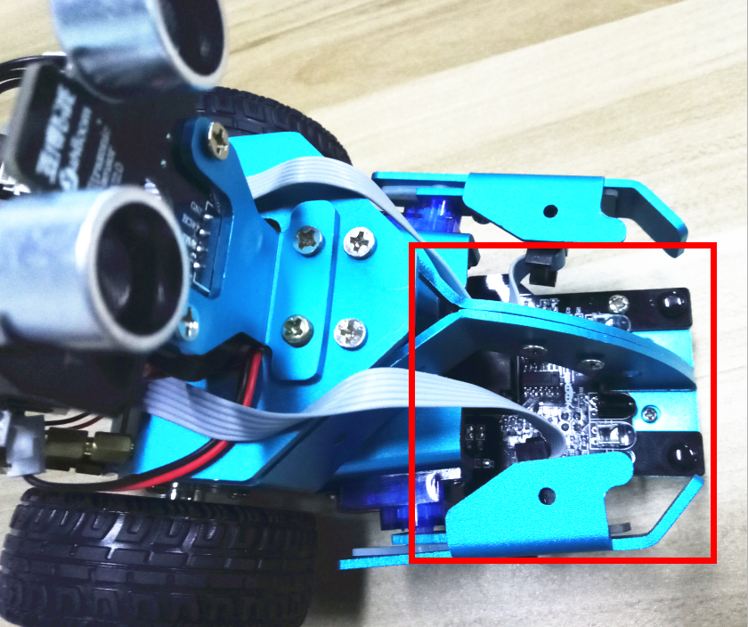
.. |image1| image:: ./chapter16/media/image2.png
   :width: 3.28056in
   :height: 2.73958in
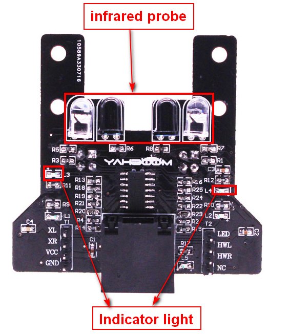
.. |image3| image:: ./chapter16/media/image4.png
   :width: 5.76389in
   :height: 5.79167in
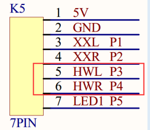
.. |image5| image:: ./chapter16/media/image6.png
   :width: 5.76181in
   :height: 3.14792in
.. |image6| image:: ./chapter16/media/image7.png
   :width: 5.76319in
   :height: 3.97222in
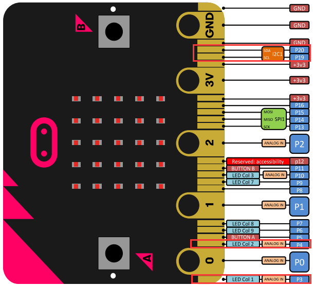
.. |image8| image:: ./chapter16/media/image9.png
   :width: 0.93472in
   :height: 0.79514in
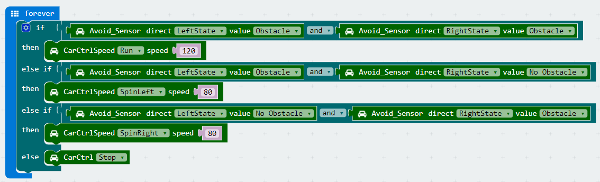
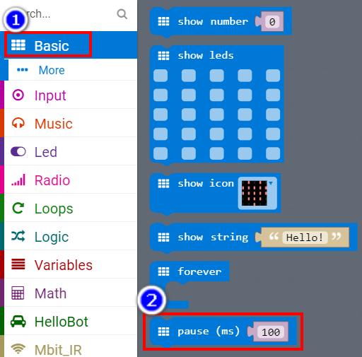
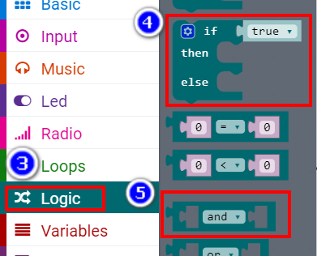
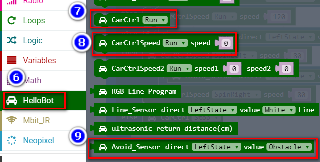
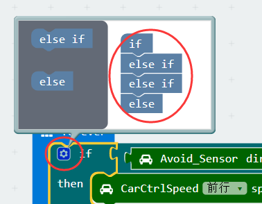
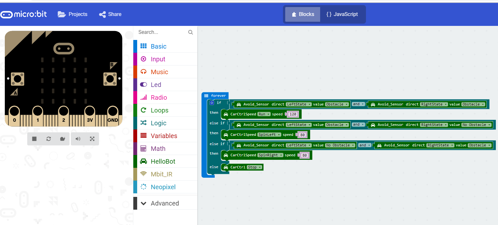
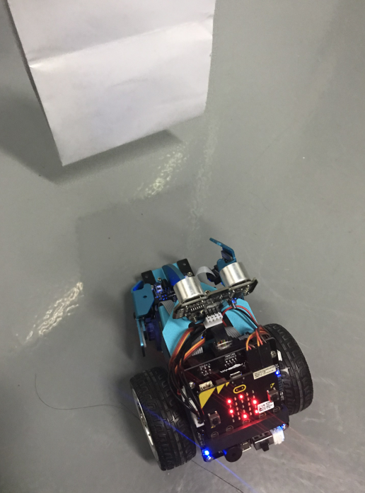
