**Chapter18 :Bluetooth remote control**

\ |image0|

**Case1:** If your HelloBot is a Basic version HelloBot robot, you need
to download the Bluetooth program **[Basic version Bluetooth control];**

**Case2:** If your car is a Clip version HelloBot robot, please download
the Bluetooth program **[Clip version Bluetooth control]; **

**Case3:** If your car is a Lift version HelloBot robot, please download
the Bluetooth program **[Lift version Bluetooth control]. **

(1)At this time, you should open the mobile phone Bluetooth and open the
application [HelloBot], if prompted some message please click [Allow],
otherwise you will not be able to use this application. As shown in the
following figure.

|image1|

Bluetooth is automatically connected when the Mobile phone is near the
robot. The indicator light of the Bluetooth module is not flashing after
the connection is successful. As shown in the following figure.

(2)After successful connection,enter the main control page.

Part 1:

|image2|

Part 2:

|image3|

Part 3:

|image4|

**(2)--1 Mesh**

|image5|

When multiple HelloBot cars download the Bluetooth program, click
**“join team”** to enter the formation. All the colorful lights of the
car are green, indicating that the formation is successful. You can
directly control the car to complete some actions, or you can directly
click **“exit team”** to leave the formation.

(2) **--2 Control**

When controlling, you can choose three versions:

**clamp(clip version),forklift(lift version),arm(Basic version).**

|image6|

|image7|

|image8|

**(2)--3 Music**

|image9|

**(2)--3 Draw Line**

|image10|

(3)Mode choice

|image11|

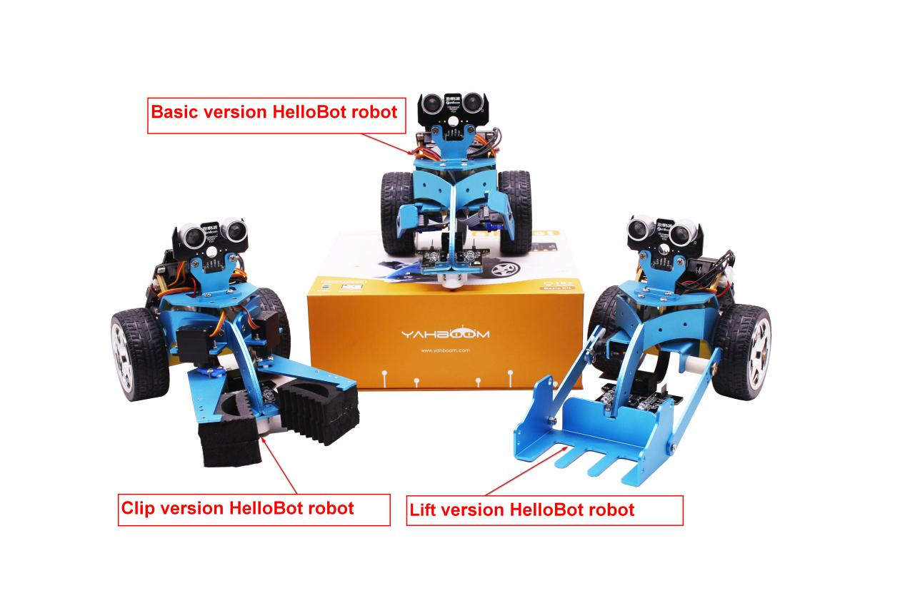
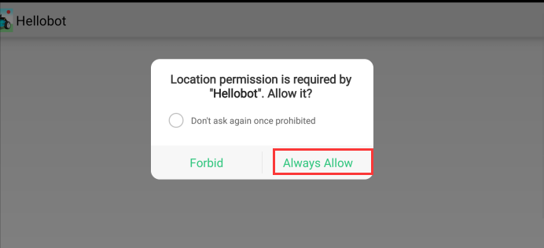
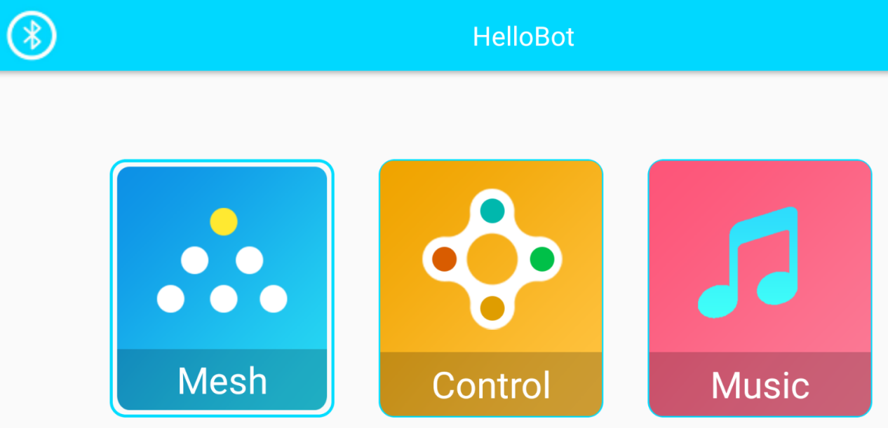
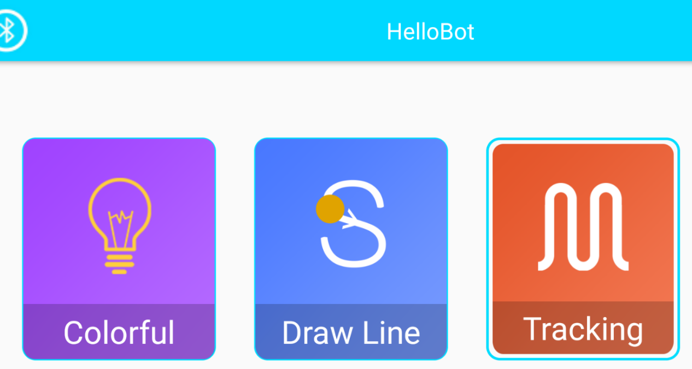
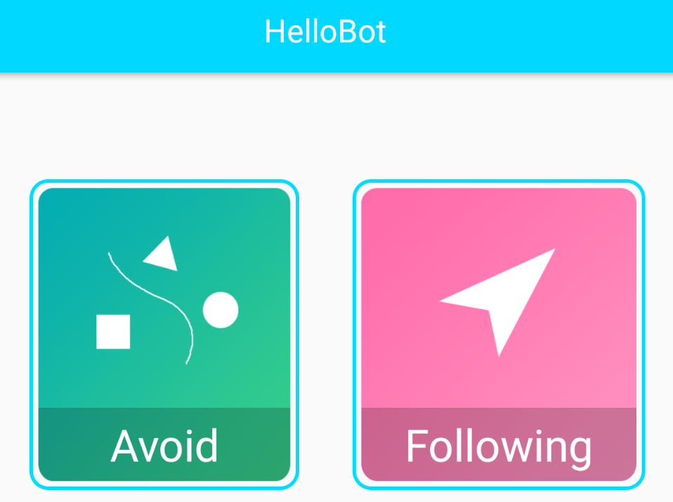
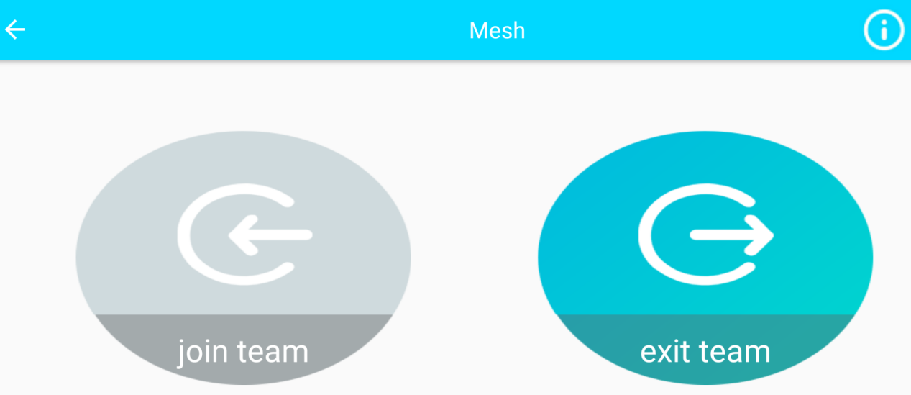
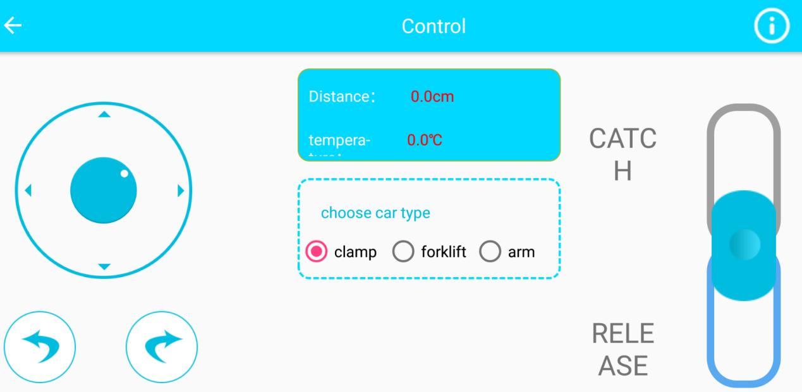
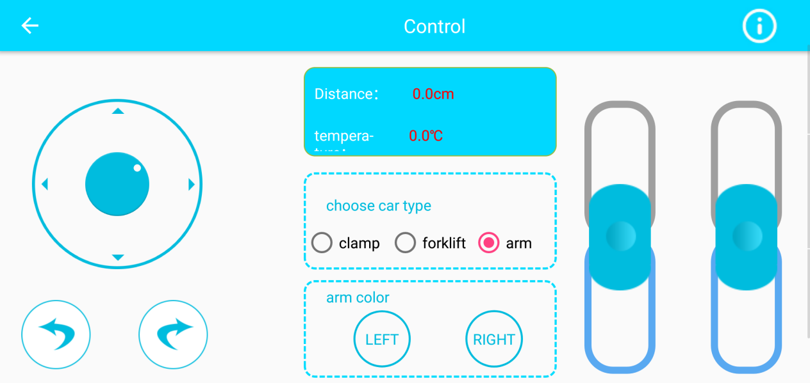
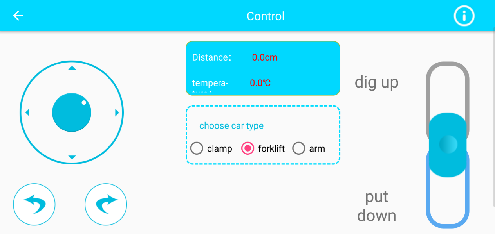
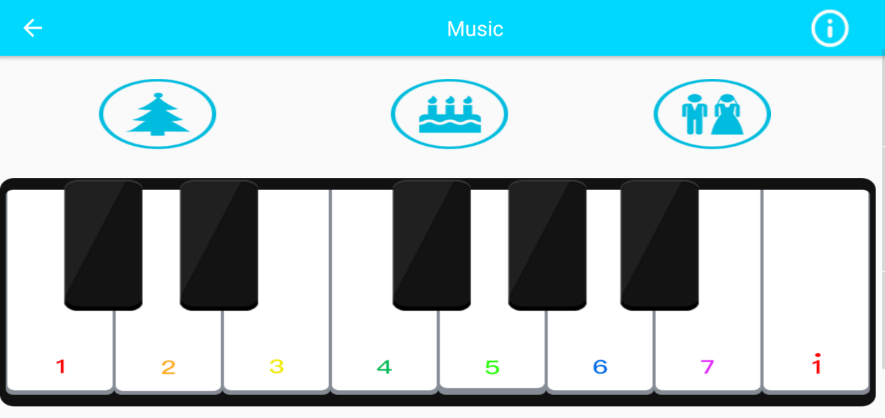
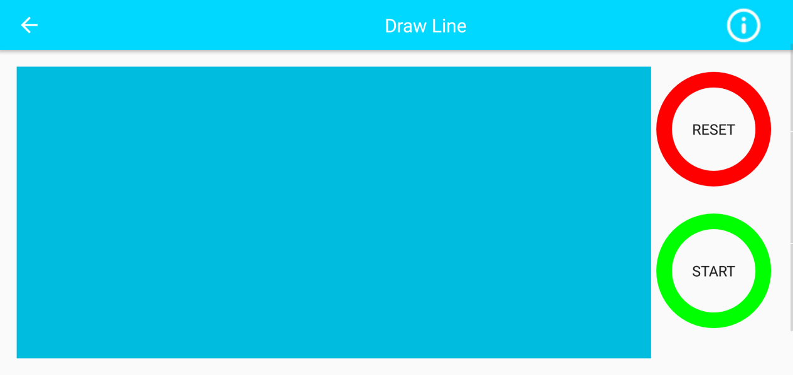
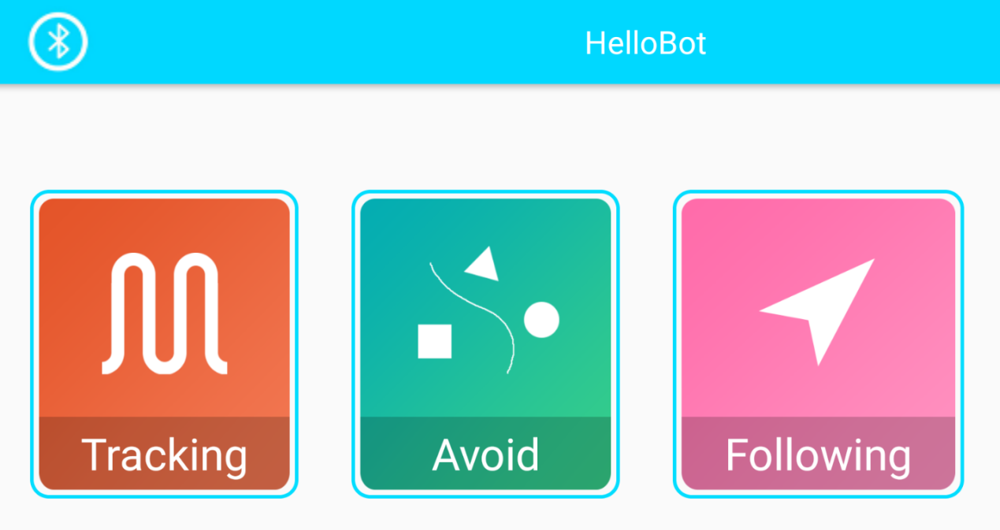
