Chapter2 :로봇에 있는 다양한 컬러 빛을 내보자
====================================================================

1.Preparation
--------------------
1.You should learn about the position of the colorful lights in the body
of hellobot；

2.You should learn about the micro:bit pins connected to the colorful
lights in the schematic.

|image0|

1-2-1 colorful lights on body of hellobot（back）

|image1|

1-2-2 colorful lights on body of hellobot

We can make different colors of light and brightness by programming.

|image2|

1-2-3 schematic

|image3|

1-2-4 Pins of Micro:bit

From the schematic diagram in P1-1-3, you can see that the colorful
lights is connected to the P16 of the Micro:bit.

Note:In the bottom layer of the HelloBot package has been set parameter
for the user, you can directly drag the colorful lights building blocks.

2. **Learning goals**

In this lesson, we will learn to light up four colorful lamps in turn,
the colorful lamps will emit light of different colors.

**3.Programming**

3.1 Programming online

1) You should use the USB cable to connect the micro:bit to the
computer, at this point, the computer will have a micro:bit U disk. You
need to open it, click micro:bit website, then entered the micro:bit
website or you can enter the URL directly in your browser:
http://microbit.org/

2) After entering the programming interface, you need to click Add
package and copy the HelloBot package URL:
https://github.com/lzty634158/HelloBot to the input field, click to
confirm the add package. Then you can use the blocks of the HelloBot
package.

3.2 Programming offline

1) You can double-click to use it. As shown in the following figure.

|image4|

2) After entering the programming interface, you need to click Add
package and copy the HelloBot package URL:
https://github.com/lzty634158/HelloBot to the input field, click to
confirm the add package. Then you can use the blocks of the HelloBot
package.

**Note: The package only needs to be added once. If you have added
packages in the previous lessons, this course does not need to be added
repeatedly.**

|image5|

1-2-5 total program

The locations of blocks in the total program are shown in the following
figure.

|image6|

1-2-6

|image7|

1-2-7

|image8|

1-2-8

**4.Download programming**

You need to make sure that the micro:bit development board is connected
to the computer. Then you should click on the download in the lower left
corner as shown in P 1-2-9 to download the program to micro:bit.

|image9|

1-2-9

5. **Phenomenon**

After the code is uploaded. You can see that four colorful lamps are lit
up in turn.

|image10| |image11|

1-2-10 1-2-11

|image12| |image13|

1-2-12 1-2-13

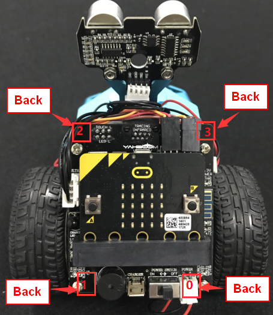
.. |image1| image:: ./chapter2/media/image2.png
   :width: 3.28194in
   :height: 3.37569in
.. |image2| image:: ./chapter2/media/image3.png
   :width: 5.76319in
   :height: 1.42569in
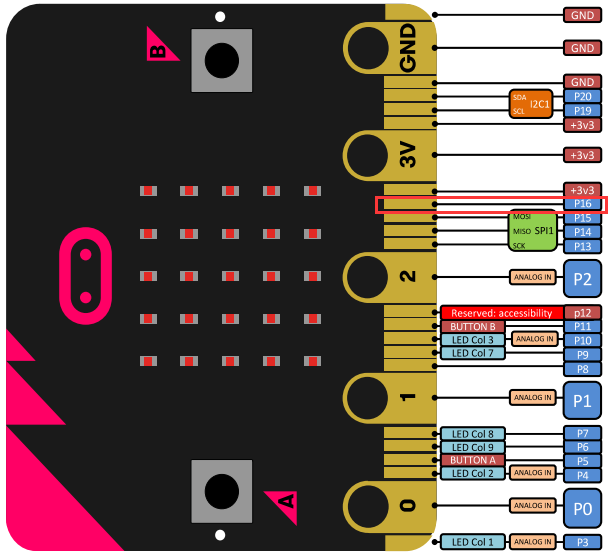
.. |image4| image:: ./chapter2/media/image5.png
   :width: 0.93472in
   :height: 0.79514in
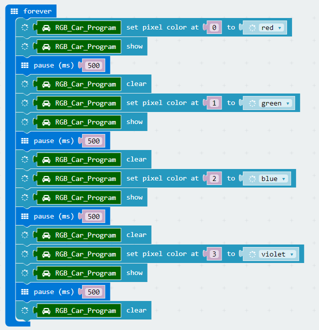
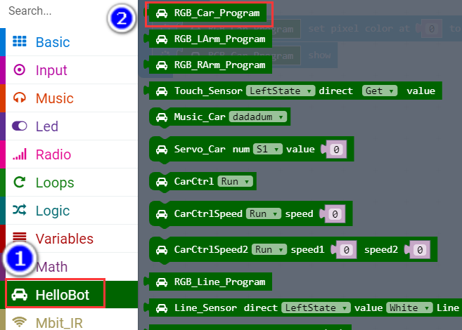
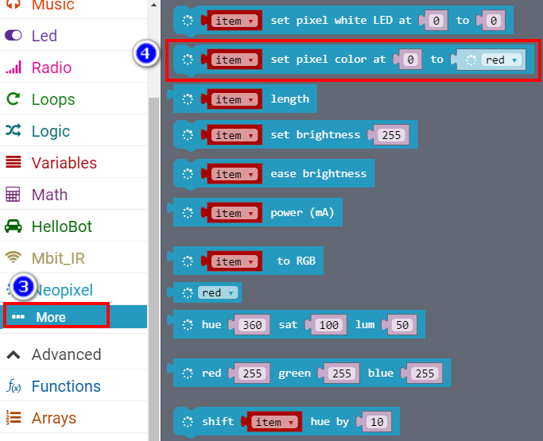
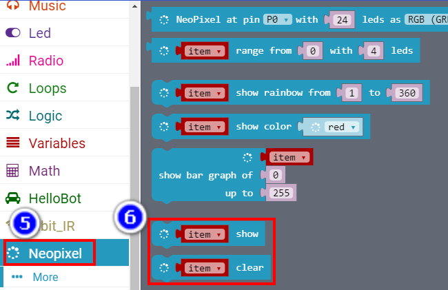
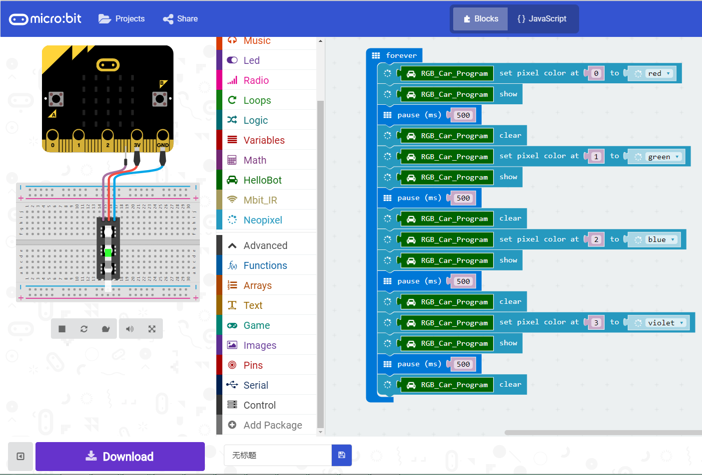
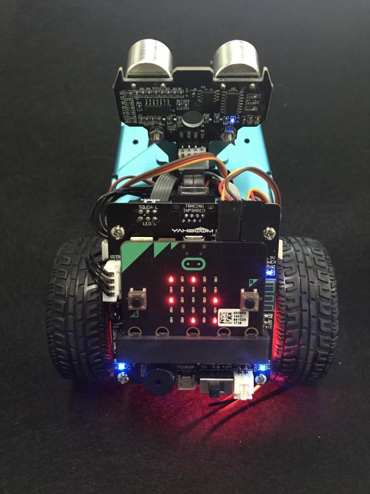
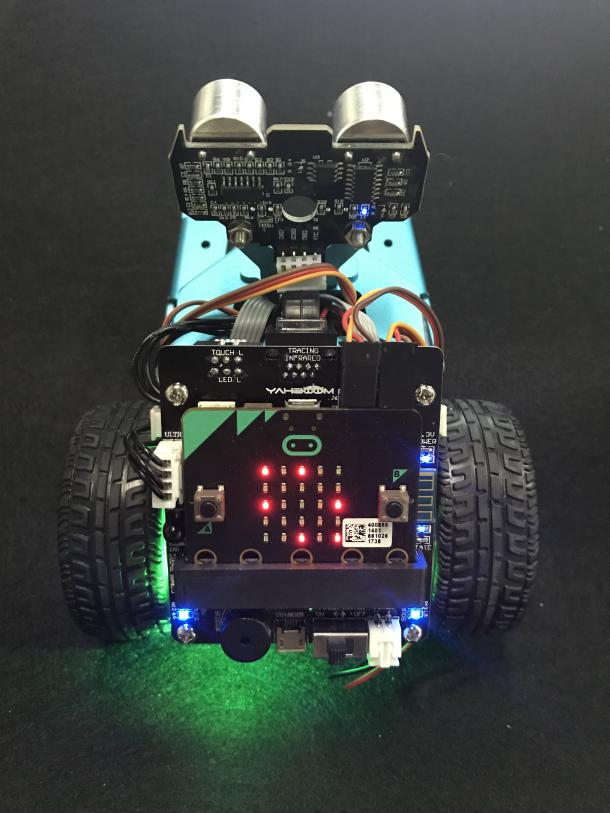
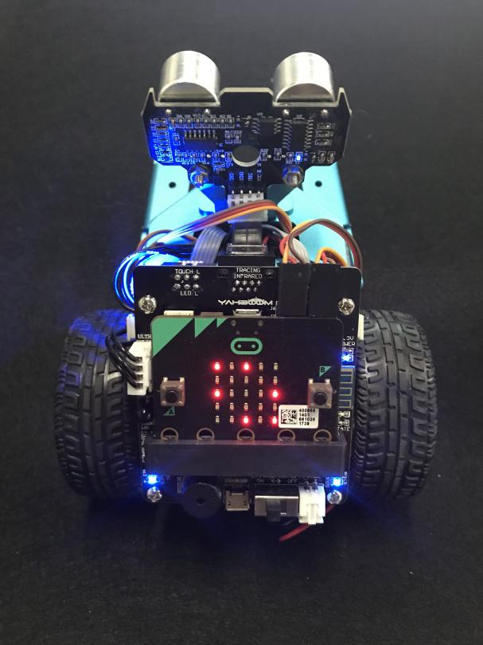
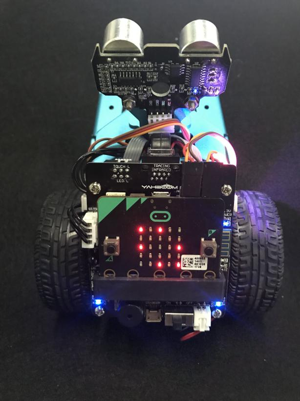
