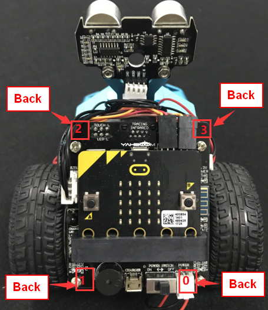
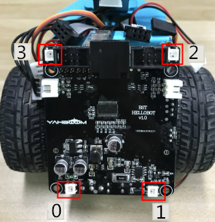
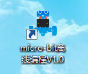

Chapter3 :숨쉬는 불빛을 만들어 보자
====================================================================

1.Preparation
--------------------

1.You should learn about the position of the colorful lights in the body
of hellobot；

2.You should learn about the micro:bit pins connected to the colorful
lights in the schematic.

|image0|

1-3-1 colorful lights on body of hellobot（back）

|image1|

1-3-2 colorful lights on body of hellobot

We can make different colors of light and brightness by programming.

|image2|

1-3-3 schematic

|image3|

1-3-4 Pins of Micro:bit

From the schematic diagram in P1-3-3, you can see that the colorful
lights is connected to the P16 of the Micro:bit.

Note:In the bottom layer of the HelloBot package has been set parameter
for the user, you can directly drag the colorful lights building blocks.

2. **Learning goals**

In this course, we learns the new game of colorful lamps - breathing
lights. Breathing light: the colorful lamps are changed gradually from
light to dark by the control of the micro:bit. It feels like a person is
breathing.

**3.Programming**

3.1 Programming online

1) You should use the USB cable to connect the micro:bit to the
computer, at this point, the computer will have a micro:bit U disk. You
need to open it, click micro:bit website, then entered the micro:bit
website or you can enter the URL directly in your browser:
http://microbit.org/

2) After entering the programming interface, you need to click Add
package and copy the HelloBot package URL:
https://github.com/lzty634158/HelloBot to the input field, click to
confirm the add package. Then you can use the blocks of the HelloBot
package.

3.2 Programming offline

1) You can double-click to use it. As shown in the following figure.

|image4|

2) After entering the programming interface, you need to click Add
package and copy the HelloBot package URL:
https://github.com/lzty634158/HelloBot to the input field, click to
confirm the add package. Then you can use the blocks of the HelloBot
package.

**Note: The package only needs to be added once. If you have added
packages in the previous lessons, this course does not need to be added
repeatedly.**

|image5|

1-3-5 total program

The locations of blocks in the total program are shown in the following
figure.

|image6|

1-3-6

|image7|

1-3-7

|image8|

1-3-8

|image9|

1-3-9

|image10|

1-3-10

|image11|

1-3-11

|image12|

1-3-12

**4.Download programming**

You need to make sure that the micro:bit development board is connected
to the computer. Then you should click on the download in the lower left
corner as shown in P 1-3-13 to download the program to micro:bit.

|image13|

1-3-13

**5.Phenomenon**

After the code is uploaded. You can see that the colorful lamps of robot
are changed gradually from light to dark by the control of the
micro:bit. It feels like a person is breathing. As shown in the
following figure.

|image14| |image15|

(a) (b)

|image16| |image17|

(c) (d)

1-3-14

.. |image3| image:: ./chapter3/media/image4.png
   :width: 5.76597in
   :height: 5.28264in

.. |image7| image:: ./chapter3/media/image8.png
   :width: 5.30000in
   :height: 3.89028in

.. |image9| image:: ./chapter3/media/image10.png
   :width: 4.81181in
   :height: 4.14861in

.. |image11| image:: ./chapter3/media/image12.png
   :width: 5.41458in
   :height: 3.85139in
.. |image12| image:: ./chapter3/media/image13.png
   :width: 5.56389in
   :height: 4.61389in

