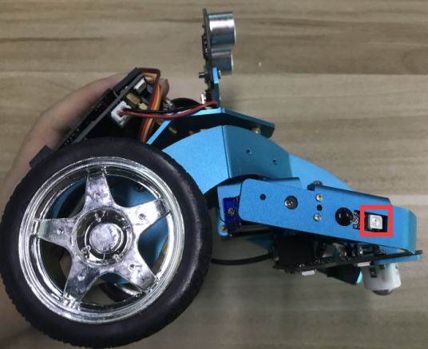
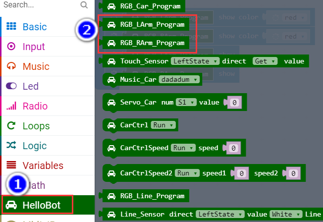

Chapter4 :로봇 팔의 불빛을 켜보자
====================================================================

1.Preparation
--------------------

1.You should learn about the position of the magic lights in the arm of
hellobot；

2.You should learn about the principle of touch magic lights;

3.You should learn about the micro:bit pins connected to the magic
lights in the schematic.

|image0| |image1|

(a)touch magic lights on the left arm (b)touch magic lights on the right
arm

|image2|

2-1-1touch magic lights on arm of hellobot

The touch magic light is mounted on the two arms of the HelloBot robot,
one for each of the left and right arms. The touch magic light is a
whole module consisting of a touch module and a colorful water light.

|image3| |image4|

(a)magic lights (b)touch position

2-1-2 touch magic lights module

The touch magic light is connected to the expansion board by a 6PIN gray
cable. The left touch magic light is connected to the left interface of
the expansion board, and the right touch magic light is connected to the
right interface of the expansion board, and the anti-reversing socket is
adopted.As shown in the following figure.

|image5|

2-1-3 about wiring

|image6|

2-1-4 schematic

|image7|

2-1-5 Pins of Micro:bit

From the schematic diagram in P2-1-4, you can see that the touch magic
lights is connected to the P6, P9 of the Micro:bit.

Note:In the bottom layer of the HelloBot package has been set parameter
for the user, you can directly drag the touch magic lights building
blocks.

2. **Learning goals**

This course we will study how to light touch magic lights on the body by
programming.

**3.Programming**

3.1 Programming online

1) You should use the USB cable to connect the micro:bit to the
computer, at this point, the computer will have a micro:bit U disk. You
need to open it, click micro:bit website, then entered the micro:bit
website or you can enter the URL directly in your browser:
http://microbit.org/

2) After entering the programming interface, you need to click Add
package and copy the HelloBot package URL:
https://github.com/lzty634158/HelloBot to the input field, click to
confirm the add package. Then you can use the blocks of the HelloBot
package.

3.2 Programming offline

1) You can double-click to use it. As shown in the following figure.

|image8|

2) After entering the programming interface, you need to click Add
package and copy the HelloBot package URL:
https://github.com/lzty634158/HelloBot to the input field, click to
confirm the add package. Then you can use the blocks of the HelloBot
package.

**Note: The package only needs to be added once. If you have added
packages in the previous lessons, this course does not need to be added
repeatedly.**

|image9|

2-1- 6 total program

The locations of blocks in the total program are shown in the following
figure.

|image10|

2-1-7

|image11|

2-1-8

**4.Download programming**

You need to make sure that the micro:bit development board is connected
to the computer. Then you should click on the download in the lower left
corner as shown in P 2-1-9 to download the program to micro:bit.

|image12|

2-1-9

**5.Phenomenon**

After the code is uploaded. You will see that the magic lights on the
robot's arm emit red light.

|image13|

2-1-10

.. |image1| image:: ./chapter4/media/image2.png
   :width: 2.69375in
   :height: 1.98264in
.. |image2| image:: ./chapter4/media/image3.png
   :width: 5.23958in
   :height: 5.11181in
.. |image3| image:: ./chapter4/media/image4.png
   :width: 2.20903in
   :height: 1.76736in

.. |image5| image:: ./chapter4/media/image6.png
   :width: 5.19097in
   :height: 3.60903in
.. |image6| image:: ./chapter4/media/image7.png
   :width: 4.38472in
   :height: 1.60417in
.. |image7| image:: ./chapter4/media/image8.png
   :width: 5.76806in
   :height: 5.29028in
.. |image8| image:: ./chapter4/media/image9.png
   :width: 0.93472in
   :height: 0.79514in

