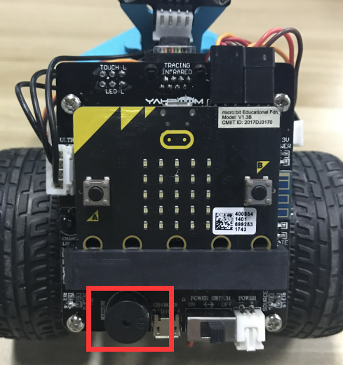
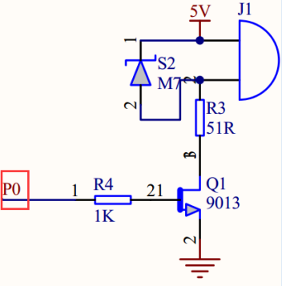
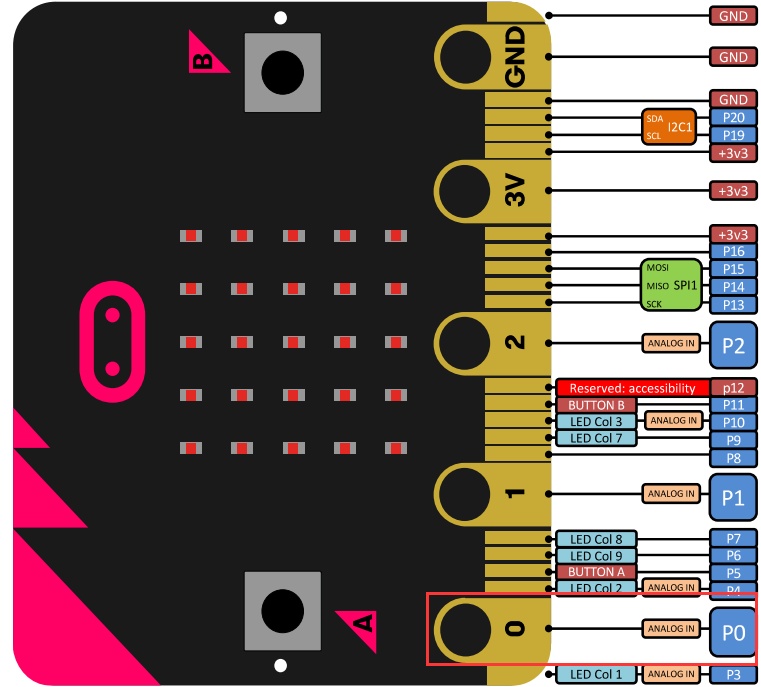
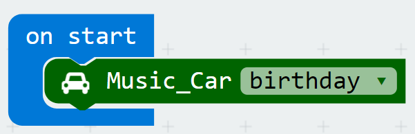
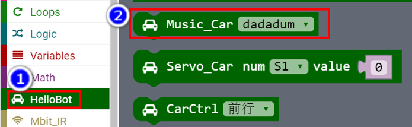
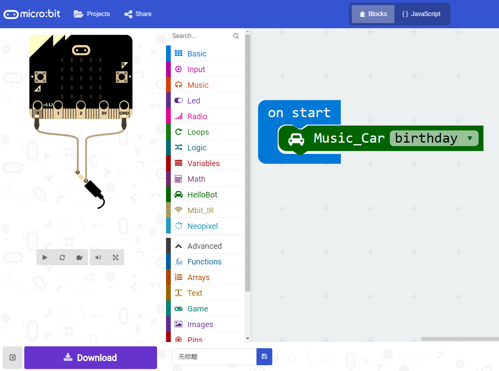

**Chapter7 :Buzzer**

\ **1.Preparation**

1.You should learn about the position of the buzzer in the body of
hellobot；

3.You should learn about the micro:bit pins connected to the buzzer in
the schematic.

|image0|

4-1-1 buzzer on arm of hellobot

|image1|

4-1-2 schematic

|image2|

4-1-3 Pins of Micro:bit

From the schematic diagram in P4-1-3, you can see that the touch magic
lights is connected to the P0 of the Micro:bit. You can use the blocks
of music directly.

2. **Learning goals**

In this course, we will study how to make HelloBot robot sing “Happy
Birthday”

**3.Programming**

3.1 Programming online

1) You should use the USB cable to connect the micro:bit to the
computer, at this point, the computer will have a micro:bit U disk. You
need to open it, click micro:bit website, then entered the micro:bit
website or you can enter the URL directly in your browser:
http://microbit.org/

2) After entering the programming interface, you need to click Add
package and copy the HelloBot package URL:
https://github.com/lzty634158/HelloBot to the input field, click to
confirm the add package. Then you can use the blocks of the HelloBot
package.

3.2 Programming offline

1) You can double-click to use it. As shown in the following figure.

|image3|

2) After entering the programming interface, you need to click Add
package and copy the HelloBot package URL:
https://github.com/lzty634158/HelloBot to the input field, click to
confirm the add package. Then you can use the blocks of the HelloBot
package.

Note: The package only needs to be added once. If you have added
packages in the previous lessons, this course does not need to be added
repeatedly.

|image4|

4-1-4 total program

The locations of blocks in the total program are shown in the following
figure.

|image5|

4-1-5

4.Download programming

You need to make sure that the micro:bit development board is connected
to the computer. Then you should click on the download in the lower left
corner as shown in P 4-1-6 to download the program to micro:bit.

|image6|

4-1-6

5.Phenomenon

After the code is uploaded. HelloBot robot will sing “Happy Birthday”.

.. |image3| image:: ./chapter7/media/image4.png
   :width: 0.93472in
   :height: 0.79514in

