Chapter8 :Arm swing
====================================================================

1.Preparation
--------------------

1.You should learn about the position of the servos in the body of
hellobot；

2.You should learn how to drive the servos with the PCA9685PW.

|image0|

5-1-1 servos on arm of hellobot

Tow servos is the robot's joint, which is mounted on the two arms of the
HelloBot. You can control servos rotate degree to control arms.

|image1|

5-1-2 about wiring

You need to look forward from the back of the robot, the left servo is
connected to the J3 interface, and the right servo is connected to the
J2 interface. The brown line of the servo corresponds to GND, the red
line corresponds to VCC, and the yellow line corresponds to IO.

|image2|

5-1-3 schematic of servo

|image3|

5-1-4 schematic of PCA9685PW

|image4|

5-1-5 Pins of Micro:bit

From the schematic diagram in P5-1-3,P5-1-4.You can see that left servo
is connected to s1 of PCA9685PW,right servo is connected to s2 of
PCA9685PW.

PCA9685PW is a 16-bit LED controller with IIC bus interface. Each LED
can output 12-bit resolution (4096 levels) fixed-frequency independent
PWM. It only needs to write the corresponding PWM register value, S1 and
S2 interface will output PWM signal to drives the servo.

(You need to look forward from the back of the robot to distinguish
between left and right.)

Note:In the bottom layer of the HelloBot package has been set parameter
for the user, you can directly drag the arm building blocks.

2. **Learning goals**

In this course, we will learn how to control arm by driving servo. When
you touch left arm of HelloBot, left arm of HelloBot will go up.When you
tuoch right arm of HelloBot, right arm of HelloBot will go down.

**3.Programming**

3.1 Programming online

1) You should use the USB cable to connect the micro:bit to the
computer, at this point, the computer will have a micro:bit U disk. You
need to open it, click micro:bit website, then entered the micro:bit
website or you can enter the URL directly in your browser:
http://microbit.org/

2) After entering the programming interface, you need to click Add
package and copy the HelloBot package URL:
https://github.com/lzty634158/HelloBot to the input field, click to
confirm the add package. Then you can use the blocks of the HelloBot
package.

3.2 Programming offline

1) You can double-click to use it. As shown in the following figure.

|image5|

2) After entering the programming interface, you need to click Add
package and copy the HelloBot package URL:
https://github.com/lzty634158/HelloBot to the input field, click to
confirm the add package. Then you can use the blocks of the HelloBot
package.

Note: The package only needs to be added once. If you have added
packages in the previous lessons, this course does not need to be added
repeatedly.

|image6|

5-1-6 total program

The locations of blocks in the total program are shown in the following
figure.

|image7|

5-1-7

|image8|

5-1-8

|image9|

5-1-9

**4.Download programming**

You need to make sure that the micro:bit development board is connected
to the computer. Then you should click on the download in the lower left
corner as shown in P 5-1-10 to download the program to micro:bit.

|image10|

5-1-10

**5.Phenomenon**

After the code is uploaded. When you touch left arm of HelloBot, left
arm of HelloBot will go up.When you tuoch right arm of HelloBot, right
arm of HelloBot will go down.

|image11|\ |image12|\ |image13|

(a)touch left arm (b)left arm go up (c)left arm go down

|image14|\ |image15|\ |image16|

(d)touch right arm (e)right arm go up (f)right arm go down

5-1-11

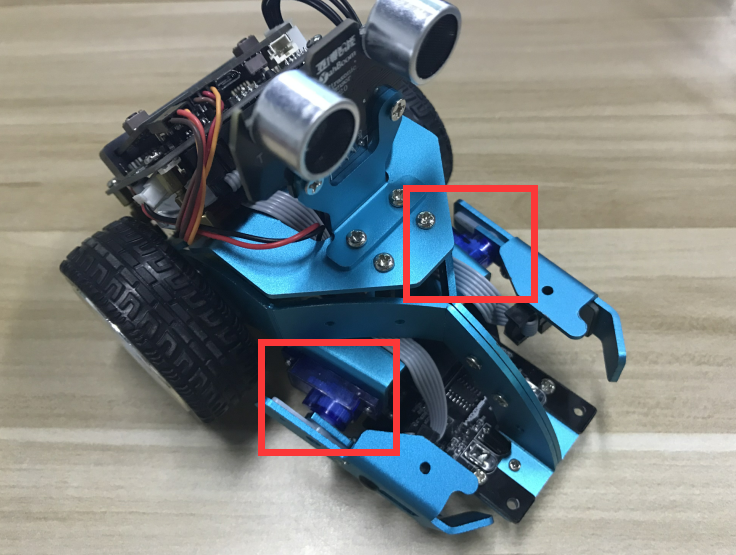
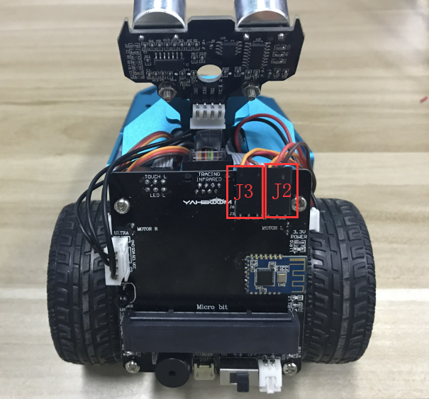
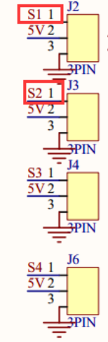
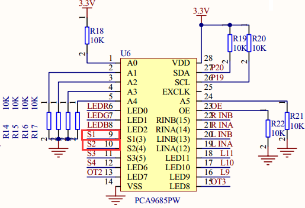
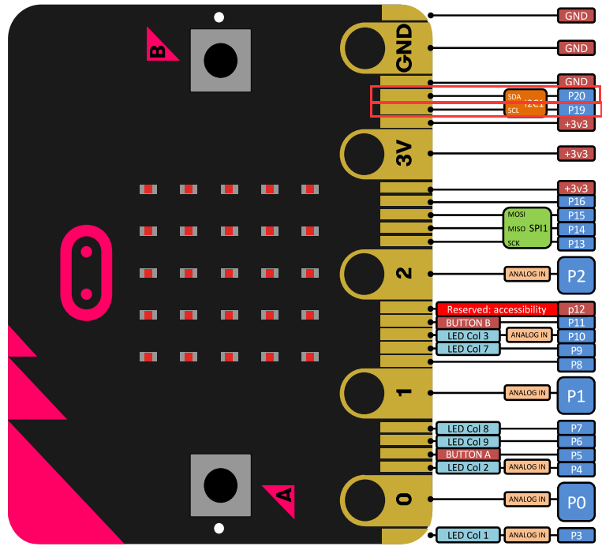
.. |image5| image:: ./chapter8/media/image6.png
   :width: 0.93472in
   :height: 0.79514in
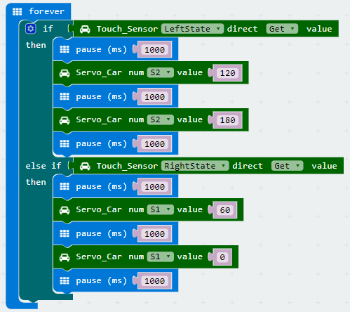
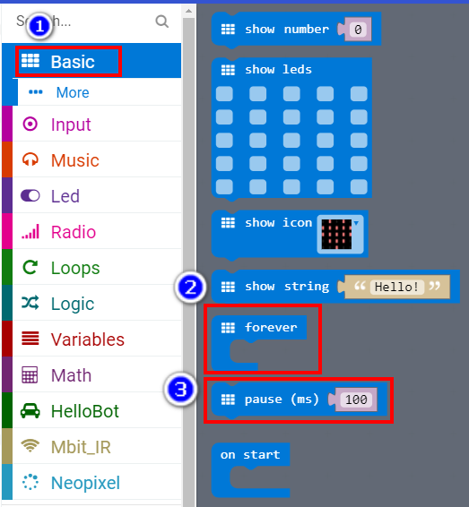
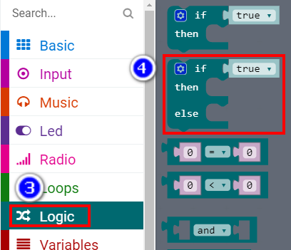
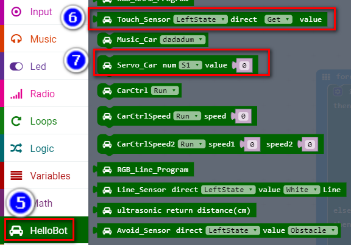
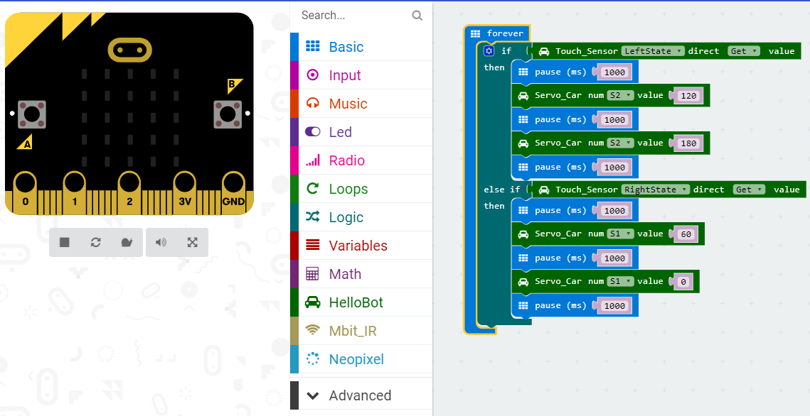
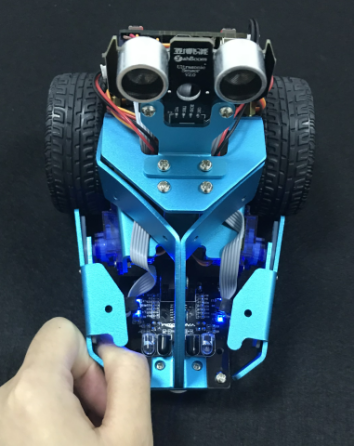
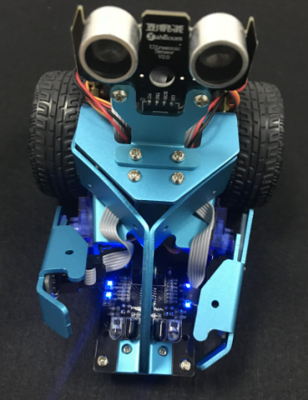
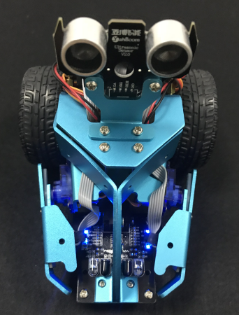
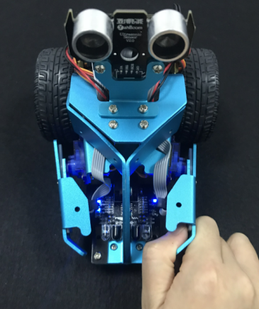
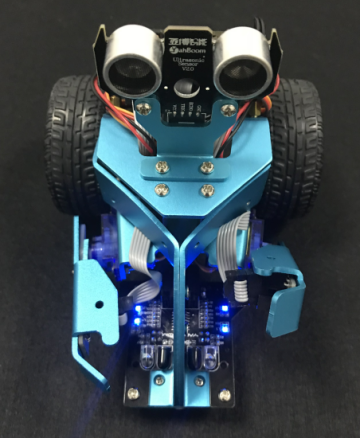

