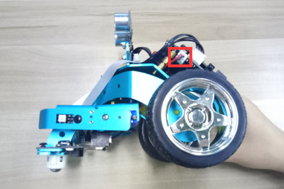
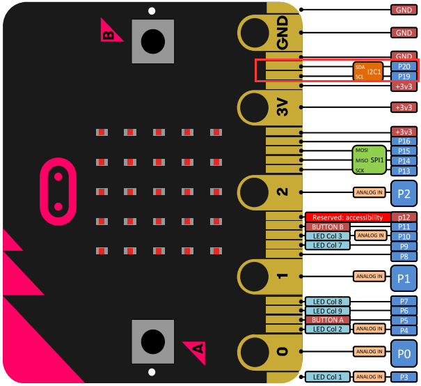

\ **Chapter9 :HelloBot advance**

\ **1.Preparation**

1.You should learn about the position of the motors in the body of
hellobot；

2.You should learn how to drive the motors with the PCA9685PW.

|image0| |image1|

(a)Left motor on the hellobot (b)Right motor on the hellobot

|image2|

6-1-1 tow motors

The HelloBot robot uses two yellow TT DC gear motors, and the rotation
of the motor drives the wheel forward. The motor on the left is
connected to the left side of the expansion board, and the motor on the
right is connected to the right side of the expansion board.

|image3|

6-1-2 schematic of motor drive

|image4|

6-1-3 schematic of PCA9685PW

|image5|

6-1-4 Pins of Micro:bit

From the schematic diagram in P6-1-3,P6-1-4.You can see that tow motors
is connected to LINA(12)、LINB(13)、RINA(14)、RINB(15) of PCA9685PW.

PCA9685PW is a 16-bit LED controller with IIC bus interface. Each LED
can output 12-bit resolution (4096 levels) fixed-frequency independent
PWM.

To advance the robot, it is only necessary to make LINA (12) output high
level, LINB (13) output low level, RINA (14) output high level, RINB
(15) output low level. PCA9685PW connects micro:bit P19 and P20 pins for
I2C communication.

Note:In the bottom layer of the HelloBot package has been set parameter
for the user, you can directly drag the car control building blocks.

2. **Learning goals**

In this course, we will learn how to make HelloBot robot advance.

**3.Programming**

3.1 Programming online

1) You should use the USB cable to connect the micro:bit to the
computer, at this point, the computer will have a micro:bit U disk. You
need to open it, click micro:bit website, then entered the micro:bit
website or you can enter the URL directly in your browser:
http://microbit.org/

2) After entering the programming interface, you need to click Add
package and copy the HelloBot package URL:
https://github.com/lzty634158/HelloBot to the input field, click to
confirm the add package. Then you can use the blocks of the HelloBot
package.

3.2 Programming offline

1) You can double-click to use it. As shown in the following figure.

|image6|

2) After entering the programming interface, you need to click Add
package and copy the HelloBot package URL:
https://github.com/lzty634158/HelloBot to the input field, click to
confirm the add package. Then you can use the blocks of the HelloBot
package.

Note: The package only needs to be added once. If you have added
packages in the previous lessons, this course does not need to be added
repeatedly.

|image7|

6-1-5 total program

The locations of blocks in the total program are shown in the following
figure.

|image8|

6-1-6

**4.Download programming**

You need to make sure that the micro:bit development board is connected
to the computer. Then you should click on the download in the lower left
corner as shown in P 6-1-7 to download the program to micro:bit.

|image9|

6-1-7

**5.Phenomenon**

After the code is uploaded. The car will advance.

|image10|

6-1-8

.. |image0| image:: media/image1.png
   :width: 2.56042in
   :height: 1.67847in

.. |image4| image:: media/image5.png
   :width: 5.76319in
   :height: 3.97222in

.. |image6| image:: media/image7.png
   :width: 0.93472in
   :height: 0.79514in

